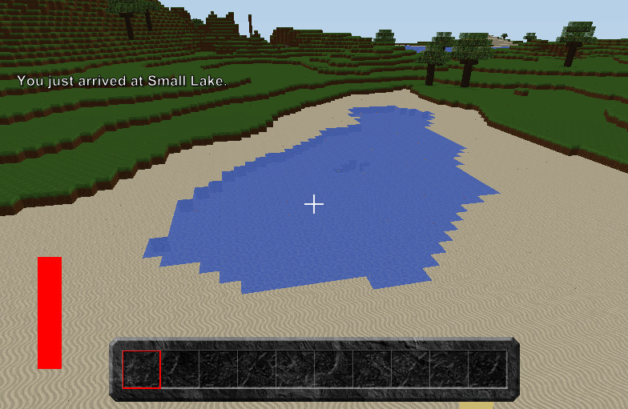

Locations Mod by croxxx
=======================

Description
-----------
This mod adds location announcements to your server.
Every time a player enters one of the locations a message is displayed.

Following command is added

	/location

Command options are

	add [startx] [starty] [startz] [endx] [endy] [endz] [name]
	delete [name] (deletes the specified location)
	list (lists all locations)
	clear (deletes all locations)
	help

*Don't forget to set `languageCode` correctly in the Mod file.*

Installation
------------
1. Copy `Locations.cs` into the folder `Mods\Fortress` of your Manic Digger installation.
2. Open `ServerClient.txt` in `UserData\Configuration` and add the privileges you need.
3. Start Manic Digger and add some areas.

Compatibility
-------------
- This mod just adds an extra command. It should be compatible with any other Mod.

Changelog
---------
- [1.2] Added chat prefix (all mod messages are now prefixed with `[Locations]`)
- [1.2] Added a check for empty names when adding locations
- [1.2] Introduced new save system. All locations are now stored in `UserData\LocationList.txt`
- [1.2] Fixed some general typos/wrong messages

- [1.1] Fixed `/locations clear` (previously had no privilege check!)
- [1.1] Default language changed to "EN"
