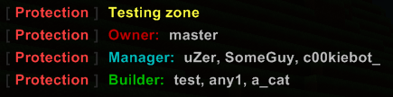
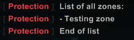

Protection Mod by croxxx
========================

Description
-----------
This mod allows protection of certain areas. No players will be able to build there without permission.
If set, members above a given permission level are able to ignore these zones (intended for admins).

Each zone is assigned one owner (by default the player who creates it). The owner can be altered manually later.
For each zone different player roles may be assigned, that allow players managing zones on their own.

### Available roles

- owner: Able to build in the zone. Can manage builders and managers. Can specify a new owner.
- manager: Able to build in the zone. Can add new builders.
- builder: Able to build in the zone.

Users who are not allowed to build in a zone get displayed an error message.

A list of all zones can be displayed using the command `/pr list`.

Optionally, a permission level can be set above which users can ignore defined zones. (By default 3: Admin rank)
The mod is fully localized in both german and english. Just make sure you select the proper language ingame using `/pr_set language_code [DE/EN]`.

Command usage
-------------
- `/protect` or `/pr`: Allows protection of new zones. Requires privilege `protect`

		start           Sets the zone start point (player position)
		end             Sets the zone end point (player position)
		set <name>      Saves the zone with the specified name
		delete [name]   Deletes the zone a player is currently in. Deletes by name if name is given (optional).
		info            Displays information about the zone a player is currently in
		list            Displays a list of all zones

- `/protect_rank` or `/pr_rank`: Allows changing player ranks in the zone the player is currently in.
  Requires privilege `protect_rank`. Can also be used by people having the privilege `protect`

		owner <name>            Set <name> as owner (player must be online)
		builder_add <name>      Assign <name> to group builder (player must be online)
		builder_remove <name>   Remove <name> from group builder
		manager_add <name>      Assign <name> to group manager (player must be online)
		manager_remove <name>   Remove <name> from group manager

- `/protect_settings` or `/pr_set`: Allows changing the mod's settings. Requires privilege `protect_settings`

		display_pos             Toggles display of zone data when a player enters a zone
		admin_ignore            Toggles the ability of admins to ignore zones
		admin_level <number>    Sets the admin level (permission level that can ignore zones)
		language_code <DE/EN>   Sets the language by language code. Supported are "DE" and "EN"

Installation
------------
1. Copy `Protection.cs` into the folder `Mods\Fortress` of your Manic Digger installation directory.
2. Open `ServerClient.txt` in `UserData\Configuration` and add the privileges you need.
3. Ingame set the options to suit your needs.
4. Done.

Available privileges
--------------------

	protect             Create/Delete protected zones. Also gives the ranking ability.
	protect_rank        Rank people in zones. Should be given to any rank that can build.
	protect_settings    Edit Mod settings.

Compatibility
-------------
- no conflicts with other mods

Changelog
---------
- [1.1] Fixed Managers not having the `protect` privilege not being able to specify members.
